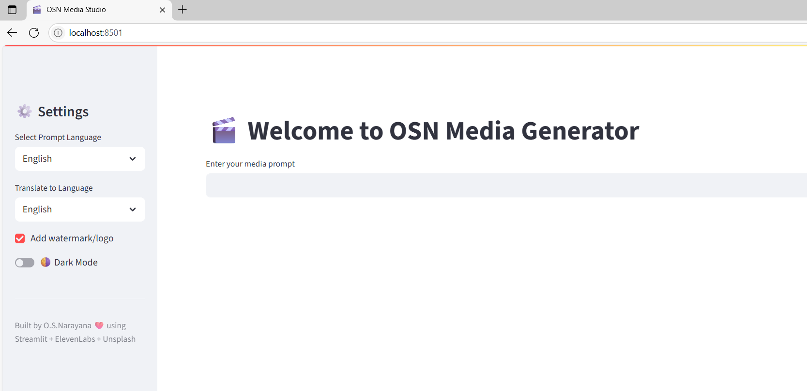
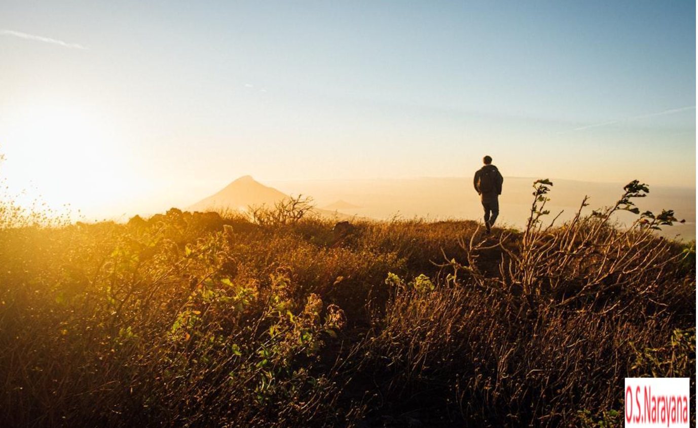
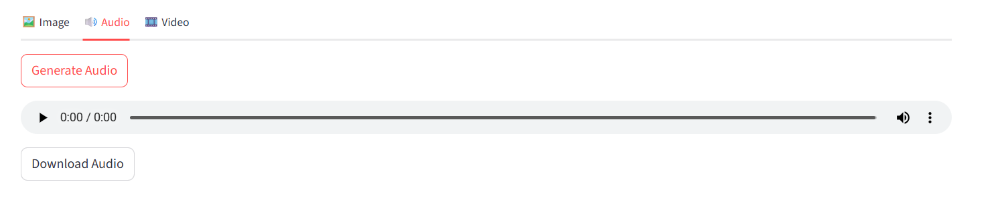
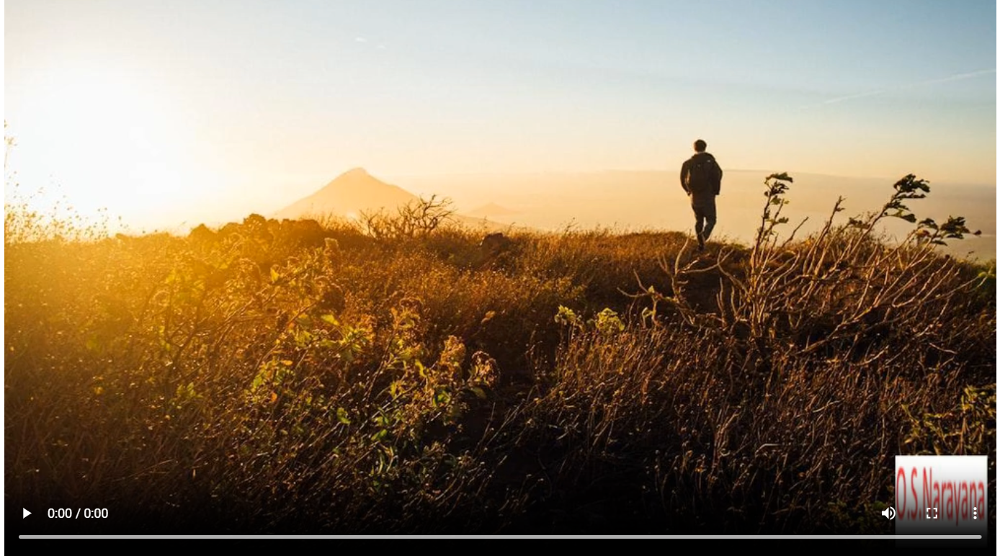

# 🧰 OSNarayana Media Generator

A clean, responsive Streamlit app to generate **🎨 images**, **🔊 audio**, and **🎬 video** from your text prompts. Designed for **multilingual communication**,
 **education**, and **public service messaging**.

---

## 🌟 Features

- 🖼️ Generate **images** using the Unsplash API
- 🗣️ Convert prompts to **realistic speech** via ElevenLabs
- 🎞️ Create **videos** combining image, voice & subtitles
- 🌐 **Multilingual translation** support
- 🆔 Optional **logo/watermark** on output
- 🌓 Light/Dark **theme toggle**
- 📲 Mobile & tablet **responsive UI**
- 📥 **Download** all generated content

---

## 🚀 Getting Started

### 🔁 1. Clone the Repository

```bash
git clone https://github.com/your-username/osnarayana-media-generator.git
cd osnarayana-media-generator
```
---

### 📦 2. Install Dependencies
	python -m venv .venv
	e.g. 
	C:\Users\fimba\OneDrive\Desktop\Github-Push\osnarayana-media-generator>python -m venv .venv

	source .venv/bin/activate  # On Windows use: .venv\Scripts\activate
	e.g. 
	C:\Users\fimba\OneDrive\Desktop\Github-Push\osnarayana-media-generator>.venv\Scripts\activate

	pip install -r requirements.txt

### 🔐 3. Add .env with API Keys
Create a .env file in the root directory:
# ElevenLabs API Key
ELEVEN_API_KEY=your_elevenlabs_api_key
# Unsplash API Key
UNSPLASH_ACCESS_KEY=your_unsplash_api_key

### ▶️ Usage
Start the app locally:
streamlit run app.py
Open in your browser at: http://localhost:8501

### 📁 Project Structure
osnarayana-media-generator/
├── app.py                  # 📋 Main Streamlit UI and logic
├── backend/
│   └── media_gen.py        # 🧠 Media generation logic
├── outputs/                # 💾 Generated media files
│   ├── images/
│   ├── audio/
│   └── videos/
├── assets/                 # 🖼️ Logo, background images
├── .env                    # 🔐 API keys (excluded via .gitignore)
├── .gitignore              # 📄 Git ignore rules
├── requirements.txt        # 📦 Dependencies
├── README.md               # 📘 This file
└── PRIVACY_POLICY.md       # 🔐 Privacy policy

### 🔐 Privacy Policy
This app does not collect, store, or share any user data. All generation happens locally or via your secure API keys. See PRIVACY_POLICY.md for details.

### 🖼️ Screenshots 
	### 🏠 Home Page UI
	 

	### 🎬 Sample Generated Image Frame
	

	### 🎬 Sample Generated Audio Frame
	

	### 🎬 Sample Generated Video Frame
	

### ⚖️ License
MIT License © O.S.Narayana